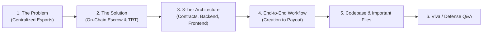
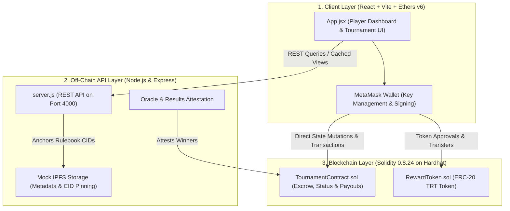

# Project Presentation Guide: Blockchain-Based Decentralized Tournament Reward & Digital Token Distribution System

**Project Title:** Blockchain-Based Decentralized Tournament Reward and Digital Token Distribution System for Esports Players to Enable Transparent Prize Distribution
**Internal Code Name:** TourneyReward
**Target Audience:** Capstone Examiners, Faculty Guides, and Technical Evaluators

---

## Table of Contents

1. [Presentation Over	view &amp; Storyline](#1-presentation-overview--storyline)
2. [Problem Statement &amp; Motivation](#2-problem-statement--motivation)
3. [Proposed Solution &amp; Core Philosophy](#3-proposed-solution--core-philosophy)
4. [Three-Tier System Architecture](#4-three-tier-system-architecture)
5. [End-to-End System Workflow (Lifecycle)](#5-end-to-end-system-workflow-lifecycle)
6. [Codebase &amp; Important Files Reference](#6-codebase--important-files-reference)
7. [Core Technical Features](#7-core-technical-features)
8. [Live Demonstration Script](#8-live-demonstration-script)
9. [Viva / Examiner Questions &amp; Answers](#9-viva--examiner-questions--answers)

---

## 1. Presentation Overview & Storyline



---

## 2. Problem Statement & Motivation

### The Issues in Traditional Esports Platforms:

1. **Centralized Custody & Counterparty Risk**:
   - Traditional tournament websites collect player entry fees and hold prize money in private bank accounts.
   - Organizers can withhold payouts, delay rewards for months, deduct hidden fees, or shut down without paying winners.
2. **Lack of Verifiable Accounting**:
   - Players have no way to verify whether the accumulated entry fees actually made it into the promised prize pool.
3. **Opaque Dispute Resolution**:
   - Centralized databases can be modified without leaving a public, tamper-proof audit trail.

---

## 3. Proposed Solution & Core Philosophy

Our solution eliminates the centralized middleman by transitioning tournament custody to an **autonomous, on-chain smart contract ecosystem**:

1. **Non-Custodial Escrow**: Prize funds and player entry fees are locked directly in Solidity smart contracts upon deposit. The funds cannot be redirected or withdrawn outside of contract rules.
2. **Dual-Currency Payout Architecture**:
   - **Native Cryptocurrency (ETH)**: Direct Wei/ETH-based pools for open tournaments.
   - **Custom ERC-20 Utility Token (TRT - Tournament Reward Token)**: Dedicated esports token used for entry fees, community incentives, and volatility-free prize distributions.
3. **Decentralized Metadata Storage (IPFS)**: Game rules, bracket IDs, and match details are pinned off-chain to keep gas costs low, while the cryptographic Content Identifier (CID) is anchored on-chain.
4. **Transparent, Immutable Audit Trail**: Every tournament creation, player entry, and prize payout emits indexed blockchain events, enabling real-time auditing by anyone.

---

## 4. Three-Tier System Architecture



1. **Blockchain Layer (Ethereum / Hardhat)**:
   - Houses the business logic and financial state.
   - Deployed on local Hardhat Network (Chain ID: `31337`, RPC: `http://127.0.0.1:8545`).
2. **Backend API Layer (Node.js / Express)**:
   - Indexes tournament state for high-performance frontend queries.
   - Simulates IPFS metadata pinning and off-chain match results reporting.
3. **Frontend Client Layer (React / Vite / Ethers.js v6)**:
   - Provides an intuitive interface for players to connect MetaMask, view open tournaments, join matches, and track payouts via live event feeds.

---

## 5. End-to-End System Workflow (Lifecycle)

### Step 1: Wallet Connection & Global Player Registration

- The player connects their **MetaMask** wallet to the dApp.
- The player triggers `registerPlayer()` on `TournamentContract.sol` to record their Ethereum address in the global player directory.

### Step 2: Tournament Creation & Escrow Locking

- The tournament organizer submits tournament parameters: title, max players, entry fee, and rules.
- **Off-chain**: Rules and brackets are pinned to IPFS, generating a CID (e.g., `Qm...`).
- **On-chain**:
  - **ETH Tournament**: Admin calls `createTournament()`, depositing initial prize funds via `msg.value`.
  - **TRT Tournament**: Admin approves and calls `createTokenTournament()`, depositing TRT tokens into contract escrow.

### Step 3: Player Entry & Dynamic Prize Pool Growth

- Players browse open tournaments on the dashboard.
- Clicking **"Join"** triggers a transaction:
  - For ETH: The exact entry fee is deposited to the contract.
  - For TRT: The contract transfers TRT tokens from the player's wallet via `transferFrom()`.
- The prize pool increments automatically (`prizePool += msg.value` or `tokenPrizePools[id] += fee`).
- When the participant limit is met (`currentPlayers == maxPlayers`), the contract automatically advances the tournament status from `Open` to `InProgress`.

### Step 4: Off-Chain Match Resolution & Oracle Attestation

- Players compete in the esports game (e.g., Valorant, CS:GO).
- The match outcome is verified by the tournament referee or game server API.
- The result is reported back through the oracle role (`onlyAdminOrOracle`).

### Step 5: Trustless, Automated Winner Payout

- The contract invokes `distributePrize(tournamentId, winner)` or `distributeTokenPrize(tournamentId, winner)`.
- **Contract Safety Invariants Verified**:
  1. Tournament must exist and not be cancelled.
  2. Prize must not have already been distributed (`!prizeDistributed`).
  3. The declared winner **must be a verified participant** in the tournament.
- The contract transfers 100% of the escrowed funds directly to the winner's wallet address.
- Tournament status transitions to `Completed`.

### Step 6: Real-Time Event Audit Logging

- The contract fires the `PrizeDistributed` or `TokenPrizeDistributed` event.
- The React frontend receives the log through an Ethers.js websocket/provider listener and updates the **Live Event Feed** instantly.

---

## 6. Codebase & Important Files Reference

| File                                                                       | Subsystem        | Description & Responsibilities                                                                                                                                                 |
| :------------------------------------------------------------------------- | :--------------- | :----------------------------------------------------------------------------------------------------------------------------------------------------------------------------- |
| [`contracts/TournamentContract.sol`](../contracts/TournamentContract.sol) | Smart Contract   | Manages tournament lifecycle, player rosters, on-chain escrow pools (ETH and TRT), access control (`onlyAdmin`, `onlyAdminOrOracle`), and reentrancy protection.           |
| [`contracts/RewardToken.sol`](../contracts/RewardToken.sol)               | Smart Contract   | Self-contained ERC-20 utility token contract representing**TRT** (*Tournament Reward Token*). Handles minting, balances, approvals, and transfers.                     |
| [`backend/server.js`](../backend/server.js)                               | Backend API      | Express server providing REST endpoints (`/api/tournaments`, `/api/balance`, `/health`), simulated IPFS pinning adapter, JWT authentication, and oracle match reporting. |
| [`frontend/src/App.jsx`](../frontend/src/App.jsx)                         | Frontend UI      | Single-page React dashboard built with Vite and Ethers.js v6. Handles MetaMask connection, tournament creation/joining, dual token balance display, and live event monitoring. |
| [`frontend/src/config.js`](../frontend/src/config.js)                     | Frontend Config  | Exports the deployed contract addresses, backend URL, and imported JSON ABIs for frontend contract interactions.                                                               |
| [`scripts/deploy_tournament.js`](../scripts/deploy_tournament.js)         | Devops / Scripts | Compiles and deploys both`RewardToken` and `TournamentContract` to the local node, links their references, and logs deployment addresses.                                  |
| [`scripts/deploy_live.js`](../scripts/deploy_live.js)                     | Devops / Scripts | Full automated script for spinning up fresh contract instances, funding initial accounts, and seeding sample tournaments.                                                      |
| [`tests/tournament.test.js`](../tests/tournament.test.js)                 | Automated Tests  | Unit and integration test suite asserting tournament creation, participant registration, pool escalation, and payout validity.                                                 |
| [`tests/reward-token.test.js`](../tests/reward-token.test.js)             | Automated Tests  | Test suite validating ERC-20 compliance, allowance checks, minting authority, and transfer mechanics.                                                                          |
| [`.env.example`](../.env.example)                                         | Configuration    | Reference environment file documenting RPC ports, Chain IDs, Oracle private keys, and default contract addresses.                                                              |

---

## 7. Core Technical Features

1. **Non-Custodial Escrow**: Funds are locked inside the contract bytecode—no human operator can abscond with player deposits.
2. **Dual Prize Pool Architecture**: Full native ETH support alongside custom ERC-20 TRT token support.
3. **Gas Optimization via Hybrid Storage**: High-volume metadata stored off-chain (IPFS simulation) while only 32-byte content hashes are committed on-chain.
4. **Reentrancy Protection**: Custom `nonReentrant` lock combined with Checks-Effects-Interactions pattern ensures zero vulnerability to recursive withdrawal exploits.
5. **Role-Based Access Control (RBAC)**: Distinguishes between global administration, oracle match attestation, and general player registration.
6. **Live Blockchain Event Streaming**: Frontend subscribes directly to EVM event topics, providing instantaneous feedback without polling delays.

---

## 8. Live Demonstration Script

If demonstrating the system live during your presentation, follow this 4-step sequence:

```bash
# Terminal 1: Start the Local Blockchain Node
npx hardhat node

# Terminal 2: Deploy Contracts & Launch Backend
npm run deploy
npm run start:backend

# Terminal 3: Launch the Frontend Client
cd frontend && npm run dev
```

1. **MetaMask Setup**: Open `http://localhost:5173`, connect MetaMask account on Localhost (Chain ID `31337`).
2. **Create Tournament**: Fill in title, set entry fee, and deposit an initial prize pool. Show the resulting transaction popup in MetaMask.
3. **Join as a Player**: Switch to a second MetaMask account, register, and join the tournament. Point out that the prize pool dynamically grows.
4. **Complete Payout**: Trigger winner distribution. Show the winner's wallet receiving the balance, and highlight the newly appeared event in the **Live Event Feed**.

---

## 9. Viva / Examiner Questions & Answers

### Q1: Why use blockchain instead of a traditional database like MySQL or MongoDB?

> **Answer:** In a traditional database, the tournament platform has full write access and complete custody of player funds. If an organizer cancels an event or refuses to distribute winnings, players have no recourse. With blockchain smart contracts, funds are locked in an autonomous escrow contract governed by code. Neither the organizer nor the player can manipulate payout rules once funds are committed.

### Q2: Why did you implement both ETH and your own TRT token?

> **Answer:** Native ETH is subject to market price volatility, which can make entry fees unpredictable for esports competitors. Creating an ERC-20 utility token (TRT) allows the ecosystem to offer predictable pricing, community reward incentives, and zero volatility between match registration and tournament completion.

### Q3: How do you prevent an organizer from picking a fake winner and stealing the money?

> **Answer:** In `TournamentContract.sol`, the payout functions enforce the check:
> `require(isPlayerRegistered[_tournamentId][_winner], "Winner must be a registered participant");`
> An organizer cannot distribute the prize pool to an arbitrary address. The payout can only ever go to a participant who legitimately paid the entry fee and joined the tournament roster.

### Q4: How is gas consumption handled for tournament rules and brackets?

> **Answer:** On-chain storage is the most expensive operation in Ethereum. Rather than storing large bracket trees, player bios, and rulebooks directly in contract storage, we use the IPFS content-addressing pattern. We store tournament files off-chain and save only the lightweight IPFS hash (`ipfsMetadataHash`) on-chain.

### Q5: How is security handled against reentrancy attacks during payouts?

> **Answer:** We implement two layers of defense:
>
> 1. A custom `nonReentrant` mutex lock modifier that prevents recursive execution of state-modifying functions.
> 2. The **Checks-Effects-Interactions** pattern: internal state variables (`t.prizeDistributed = true; t.status = TournamentStatus.Completed;`) are updated *before* invoking external ether transfers (`_winner.call{value: payout}("")`).
